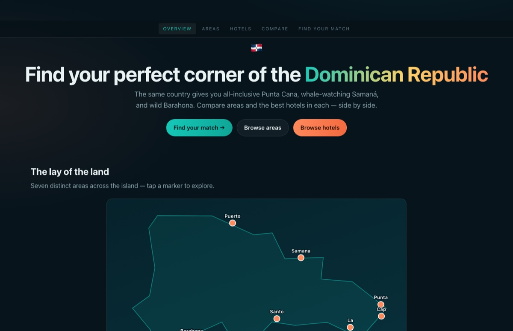
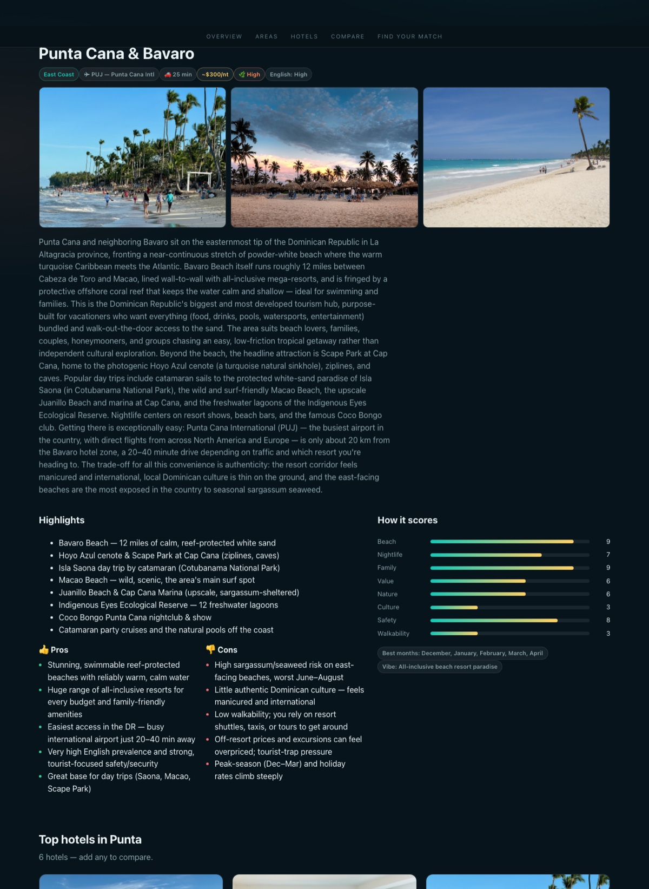
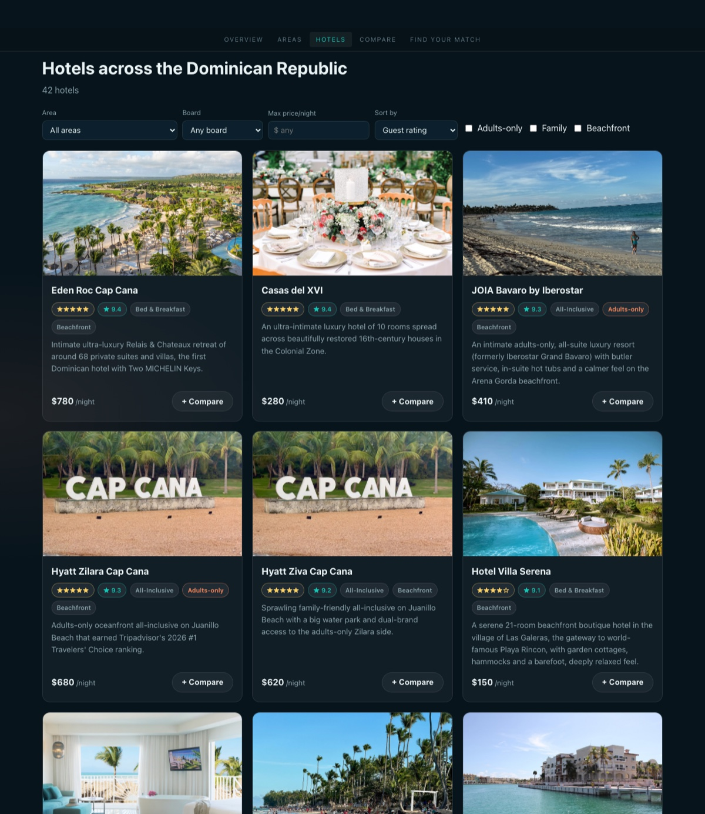
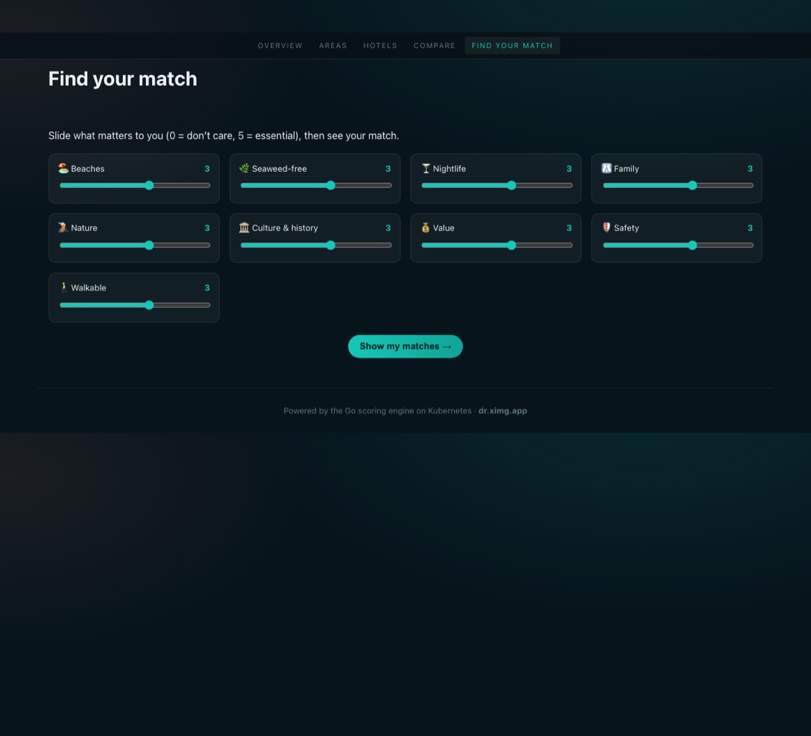

# 🇩🇴 Dominican Republic Hotel & Area Comparison

[](https://github.com/binRick/dr-hotel-comparison-kubernetes-app/actions/workflows/release.yml)
[](https://github.com/binRick/dr-hotel-comparison-kubernetes-app/actions/workflows/ci.yml)
[](LICENSE)

<p align="center">
  <a href="https://dr.ximg.app"></a>
</p>

<p align="center"><b>Live demo → <a href="https://dr.ximg.app">dr.ximg.app</a></b></p>

The Dominican Republic isn't one trip — all‑inclusive **Punta Cana**, whale‑watching
**Samaná**, kitesurfing **Cabarete**, colonial **Santo Domingo**, and wild **Barahona**
are completely different holidays in one country. This app lets you **compare the
regions and the best hotels in each, side by side** — beaches, sargassum risk,
nightlife, value, airport transfers — and a weighted *"find your match"* engine
ranks them to how *you* travel.

It's a genuinely **Kubernetes‑native** app: a Go API and an nginx frontend running
as separate, autoscaled Deployments — deployable on any cluster (k3s, kind,
minikube) with **no external dependencies**.

## Highlights

- **7 areas · 42 real hotels**, with honest descriptions, specs, prices, ratings,
  sargassum risk, airport transfers, and coordinates.
- **165 self‑hosted photos** (Wikimedia Commons + official hotel sites, each
  credited with its license) — never hot‑linked.
- **Side‑by‑side compare** for areas *or* hotels, a self‑hosted **SVG map** of the
  DR with lat/lng‑projected markers, and a **"find your match"** scoring quiz.
- **Go API** (stdlib only → 7.6 MB scratch image) with real area & hotel scoring
  engines; **vanilla‑JS frontend** (no frameworks, no CDNs).
- **Two‑tier k8s**: Deployments + Services + **HPA** + ConfigMap‑driven data,
  multi‑arch images published to GHCR by CI on every tag.

## Screenshots

| Area guide | Hotel browser | Find your match |
|---|---|---|
| [](docs/screenshots/area.jpg) | [](docs/screenshots/hotels.jpg) | [](docs/screenshots/match.jpg) |

## A real Kubernetes app — not a container in a trench coat

This isn't a single image behind a port. It uses the core k8s primitives the way a
production service would:

| Aspect | How |
|--------|-----|
| **Two independent Deployments** | `dr-web` (nginx) and `dr-api` (Go), each 2 replicas, **rolling updates** (`maxUnavailable: 0`). |
| **In‑cluster service discovery** | `dr-web` proxies `/api` to `dr-api` over a **ClusterIP** Service by DNS (`http://dr-api`) — the API is never exposed directly. |
| **Single ingress point** | `dr-web` is a **NodePort** (30080); the browser only ever talks to one origin (no CORS, no external assets). |
| **Autoscaling** | A **HorizontalPodAutoscaler** scales `dr-api` 2→5 on CPU (uses k3s's bundled metrics‑server). |
| **Health‑gated** | Liveness **and** readiness probes on both tiers. |
| **Config ≠ image** | Seed data is mounted from a **ConfigMap** (`dr-seed`) — update the data and roll out without rebuilding the image (an embedded copy is the fallback). |
| **Hardened** | `dr-api` runs `runAsNonRoot` (65534), `readOnlyRootFilesystem`, `drop: ["ALL"]`, no privilege escalation — on a `scratch` base. |
| **Resource‑bounded** | CPU/memory requests + limits on every container, sized for a small node. |
| **Declarative + portable** | Plain manifests via **kustomize**; **multi‑arch** (amd64/arm64) images. Runs on any conformant cluster, not just the reference host. |

```
            ┌──────────────────── Kubernetes namespace: dr ─────────────────────┐
 Browser ──▶│  Service dr-web  (NodePort 30080)                                  │
            │      └─ Deployment dr-web  · nginx ×2                               │
            │            ├─ /          → static frontend (vanilla JS + photos)   │
            │            └─ /api/*      → Service dr-api (ClusterIP)              │
            │                                └─ Deployment dr-api · Go ×2 + HPA   │
            │                                      └─ seed.json via ConfigMap     │
            └────────────────────────────────────────────────────────────────────┘
```

## The data

### What exists

`backend/data/seed.json` — **7 areas** and **42 hotels** (6 per area):

- **Areas**: `id, name, region, nearest_airport, airport_transfer_min, summary,
  description, vibe, best_for[], scores{beach, nightlife, family, value, nature,
  culture, safety, walkability}, sargassum_risk, avg_hotel_price_usd, whale_season,
  english_prevalence, best_months[], lat, lng, highlights[], pros[], cons[], images[]`.
- **Hotels**: `id, name, area_id, brand, stars, guest_rating, price_per_night_usd,
  board, adults_only, family_friendly, beachfront, num_restaurants, num_pools,
  num_rooms, amenities[], nearest_airport, airport_transfer_min, lat, lng,
  official_site, summary, description, pros[], cons[], images[]`.
- Every image carries `source`, `credit`, and `license` for attribution.

The areas span **Punta Cana & Bávaro, Cap Cana, Puerto Plata/Sosúa/Cabarete,
Samaná & Las Terrenas, La Romana & Bayahíbe, Santo Domingo, and Barahona**.

### How it was acquired

1. **Multi‑agent research** — a workflow of ~21 agents researched each area and the
   top hotels in it from public sources (official sites, OTA listings, Wikipedia/
   Wikimedia), then a second pass **adversarially fact‑checked** every hotel
   (real property? plausible coordinates, price, board, brand?) and dropped or
   corrected anything unverifiable.
2. **Self‑hosting the photos** — [`scripts/integrate.py`](scripts/integrate.py)
   downloads each candidate image, downscales/recompresses it, stores it under
   [`frontend/images/`](frontend/images), and rewrites the dataset to local
   `/images/...` paths — so **no image is ever hot‑linked** at runtime (a hard rule
   of the host stack). It respects Wikimedia's rate limits (thumbnail endpoint,
   throttling, exponential backoff) and falls back through old‑TLS for a couple of
   stubborn hotel sites.

`backend/data/seed.raw.json` keeps the original source URLs for provenance; rerun
the photo pipeline any time with `python3 scripts/integrate.py`.

> Data and photos are gathered from public sources for a demonstration/educational
> project; hotel details and prices are approximate and not booking‑accurate.

## API

Base path `/api`. JSON in, JSON out.

| Route | Purpose |
|-------|---------|
| `GET /api/health` | liveness/readiness |
| `GET /api/meta` | counts + the weightable dimensions |
| `GET /api/areas` | all areas |
| `GET /api/areas/{id}` | one area + its hotels |
| `GET /api/hotels` | hotels; filters: `area, board, adults_only, family, beachfront, max_price, min_rating, sort` |
| `GET /api/hotels/{id}` | one hotel |
| `GET /api/compare?type=hotel\|area&ids=a,b,c` | side‑by‑side payload |
| `POST /api/score` | body `{type:"area"\|"hotel", weights:{...}, area?}` → ranked match scores |

**Scoring dimensions** — areas: `beach, nightlife, family, value, nature, culture,
safety, walkability, low_sargassum`; hotels: `rating, value, luxury, family,
romance, beach, activities`. Example:

```bash
curl -s https://dr.ximg.app/api/score -X POST \
  -d '{"type":"area","weights":{"beach":3,"nature":2,"low_sargassum":2}}' \
  | jq '.results[0].area.name'
# → "Samaná & Las Terrenas"
```

## Quick start

Requires Docker + a single‑node Kubernetes cluster and `kubectl`.

```bash
# 1. Build images
docker build -t dr-api:v1 backend
docker build -t dr-web:v1 -f web/Dockerfile .

# 2. Make them available to your cluster's runtime
#    k3s:      docker save dr-api:v1 | sudo k3s ctr images import -   # repeat for dr-web:v1
#    kind:     kind load docker-image dr-api:v1 dr-web:v1
#    minikube: minikube image load dr-api:v1 dr-web:v1

# 3. Deploy
kubectl apply -f k8s/namespace.yaml
kubectl -n dr create configmap dr-seed --from-file=seed.json=backend/data/seed.json
kubectl apply -k k8s

# 4. Open it
#    http://<node-ip>:30080
#    or:  kubectl -n dr port-forward svc/dr-web 8080:80   → http://localhost:8080
```

Or use the **Makefile**: `make help`, then e.g. `make kind-load deploy`.
Run just the API locally (no cluster): `make run-api` → <http://localhost:8080/api/areas>.

## Container images

Tagging a release (`git tag v0.1.0 && git push --tags`) runs
[`.github/workflows/release.yml`](.github/workflows/release.yml), which builds both
images for **linux/amd64 + linux/arm64** and pushes them to GitHub Container
Registry:

```
ghcr.io/binrick/dr-api:<version>   ghcr.io/binrick/dr-api:latest
ghcr.io/binrick/dr-web:<version>   ghcr.io/binrick/dr-web:latest
```

Deploy straight from the registry — no local build:

```bash
kubectl apply -f k8s/namespace.yaml
kubectl -n dr create configmap dr-seed --from-file=seed.json=backend/data/seed.json
kubectl apply -k k8s
kubectl -n dr set image deploy/dr-api dr-api=ghcr.io/binrick/dr-api:latest
kubectl -n dr set image deploy/dr-web dr-web=ghcr.io/binrick/dr-web:latest
```

(First publish: make the two packages public under the repo's *Packages* settings
for anonymous pulls.)

## Project layout

```
backend/        Go API (stdlib only) — model, store, scoring, handlers, Dockerfile, data/seed.json
web/            nginx image (Dockerfile + nginx.conf) serving the frontend + /api proxy
frontend/       Vanilla-JS SPA (no frameworks/CDNs): pages, dr.css, app.js, favicon, images/
k8s/            namespace, dr-api Deployment/Service, dr-web Deployment/Service, HPA, kustomization, (optional) ingress
deploy/         install-k3s.sh, build-and-load.sh, nginx-dr.snippet.conf
scripts/        integrate.py — rebuilds seed.json + self-hosts photos from the research output
docs/           screenshots
```

## Running behind an existing reverse proxy

Because the whole app is one NodePort, fronting it with TLS is a one‑liner — point
a reverse proxy at `host:30080`. The reference deployment at **dr.ximg.app** does
exactly this from nginx; see [`deploy/nginx-dr.snippet.conf`](deploy/nginx-dr.snippet.conf).

## License

Code: [MIT](LICENSE). Photos remain under their original licenses as credited in
`backend/data/seed.json`.
